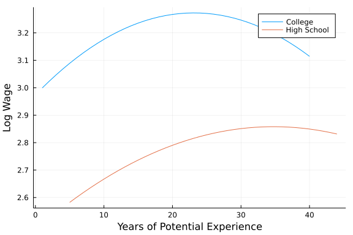

Skill Assessment
================

<!-- Review -->

# The Gender Wage Gap

What is the difference in predicted wages between men and women with the
same job-relevant characteristics? We analyze if there is a difference
in the payment of men and women (gender wage gap). The gender wage gap
may partly reflect discrimination against women in the labor market or
may partly reflect a selection effect, namely that women are relatively
more likely to take on occupations that pay somewhat less (for example,
school teaching).

# Data

The data set we consider is from the March Supplement of the U.S.
Current Population Survey, year 2015. We select white non-hispanic
individuals, aged 25 to 64 years, and working more than 35 hours per
week during at least 50 weeks of the year. We exclude self-employed
workers; individuals living in group quarters; individuals in the
military, agricultural or private household sectors; individuals with
inconsistent reports on earnings and employment status; individuals with
allocated or missing information in any of the variables used in the
analysis; and individuals with hourly wage below 3.

The variable of interest Y is the hourly wage rate constructed as the
ratio of the annual earnings to the total number of hours worked, which
is constructed in turn as the product of number of weeks worked and the
usual number of hours worked per week. In our analysis, we also focus on
single (never married) workers. The final sample is of size n = 5150.

# Variable Description

``` r

```

<!-- -->

# Problem Set

We will construct a prediction rule for hourly wage Y , which depends
linearly on job-relevant characteristics X. Consider the following
log-linear regression model:

 = \beta'X + \epsilon")

 = \beta_1 D + \beta_2'W + \epsilon")

where

is the indicator of being female (1 if female and 0 otherwise) and the
’s
are controls explaining variation in wages. Considering transformed
wages by the logarithm, we are analyzing the relative difference in the
payment of men and women.

Our goals are

-   Predict wages using various characteristics of workers.

-   Assess the predictive performance using the (adjusted) sample MSE,
    the (adjusted) sample R2, the out-of-sample MSE and R2.

We employ two different specifications for prediction:

1.  Basic Model: X consists of a set of raw regressors (e.g. gender,
    experience, education, occupation, industry and regional
    indicators).

2.  Flexible Model: X consists of all raw regressors from the basic
    model plus occupation and industry indicators transformations (e.g.,
    exp2, exp3, exp4, occ2 and ind2) and additional two-way interactions
    of polynomial in experience with other regressors. An example of a
    regressor created through a two-way interaction is experience times
    the indicator of having a college degree.

Using the Flexible Model, enables us to approximate the real
relationship by a more complex regression model and therefore to reduce
the bias. The Flexible Model increases the range of potential shapes of
the estimated regression function. In general, flexible models often
deliver good prediction accuracy but give models which are harder to
interpret.

Follow the next instructions:

-   Focus on the subset of college-educated workers (scl, clg
    variables).
-   Use appropiate plots (i.e. histograms, barplots, scatter plots, pie
    plots, etc.) to describe main variables (wage, log-wage, sex, some
    high school, high school graduated, some college, college graduated,
    advanced degree, experience)
-   Run the Basic OLS model: lwage ∼ sex + exp1 + shs + hsg + mw + so +
    we + occ2 + ind2
-   Run the Flexible OLS model: lwage ∼ sex+(exp1+exp2+exp3+exp4+shs+hsg
    +occ2+ ind2 + mw + so + we)2
-   Compare the (adjusted) sample MSE, the (adjusted) sample R2, the
    out-of-sample MSE and R2 of both models in a table.
-   Make a coefficient plot for the sex variable in both models.

<!-- review -->

## Comments

-   Data wider format
-   Training and testing data
-   Instructions:
    -   Instruccion 1: Si me centro (filtrar los datos SCL == 1 y CLG
        ==1) en esas 2 variables no podre continuar, en su totalidad del
        punto 2 al 6 , si lo hago los modelos tendran columnas con
        valores de 0 en las variables relacionadas con la educacion. Por
        lo que lo hare con los datos totales.

    -   Instrccion 3 y 4: Todos los datos

    -   Instruccion 7: comparando medias

<!--Instruccion-->

# Solutions

## R

``` r
# 
# install.packages("librarian")
knitr::opts_chunk$set(
  message = F
  , warning = F
)
options(scipen = 999)
librarian::shelf(
  tidyverse
  , here
  , tidymodels
  , gghighlight
  , forcats
  , broom
  , rsample
  , yardstick
  , coefplot
  , patchwork
)
theme_set(theme_bw())
```

``` r
wage <- read_csv(dir(here(), pattern = ".csv$", full.names = T, recursive = T))
wage_lng <- wage |> 
  pivot_longer(shs:ad, names_to = "edu") |> 
  filter(value > 0) |> 
  select(!value) |> 
  mutate(
    edu = factor(edu, c("shs", "hsg", "scl", "clg", "ad"))
    , edu1 = ifelse(edu %in% c("scl", "clg"), "College", "Other")
    , sex = ifelse(sex == 1, "Female", "Male")
         )

head(wage, 5)
```

    ## # A tibble: 5 x 21
    ##   rownames  wage lwage   sex   shs   hsg   scl   clg    ad    mw    so    we
    ##      <dbl> <dbl> <dbl> <dbl> <dbl> <dbl> <dbl> <dbl> <dbl> <dbl> <dbl> <dbl>
    ## 1       10  9.62  2.26     1     0     0     0     1     0     0     0     0
    ## 2       12 48.1   3.87     0     0     0     0     1     0     0     0     0
    ## 3       15 11.1   2.40     0     0     1     0     0     0     0     0     0
    ## 4       18 13.9   2.63     1     0     0     0     0     1     0     0     0
    ## 5       19 28.8   3.36     1     0     0     0     1     0     0     0     0
    ## # ... with 9 more variables: ne <dbl>, exp1 <dbl>, exp2 <dbl>, exp3 <dbl>,
    ## #   exp4 <dbl>, occ <dbl>, occ2 <dbl>, ind <dbl>, ind2 <dbl>

### Plots

``` r
w_edu <- 
  wage_lng |> 
  ggplot() +
  aes(y = wage, edu, fill = edu1) +
  geom_violin() 
  
lw_edu <- 
  w_edu +
  aes(y = lwage)

edu_per <- 
  wage_lng |> 
  count(edu) |> 
  mutate(per = n / sum(n)) |> 
  ggplot() +
  geom_col() +
  aes(x = fct_reorder(edu, n), per, fill = edu) +
  scale_y_continuous(label = scales::percent)
w_edu 
```

<!-- -->

``` r
lw_edu 
```

<!-- -->

``` r
edu_per
```

<!-- -->

``` r
sx_ed_w <- 
  wage_lng |> 
  ggplot() +
  aes(y = wage, sex, fill = edu1) +
  geom_violin() 
sx_ed_lw <- 
  sx_ed_w +
  aes(y = lwage)
sx_ed_w
```

<!-- -->

``` r
sx_ed_lw
```

<!-- -->

``` r
sx_ed_w <- 
  wage_lng |> 
  ggplot() +
  aes(y = exp1, sex, fill = edu1) +
  geom_violin() 
sx_ed_w
```

<!-- -->

``` r
sx_ed_w +
  aes(fill = edu, x = edu) +
  facet_wrap(~sex, ncol = 1)
```

<!-- -->

## Models

``` r
split <- rsample::initial_split(wage, prop = .6, strata = lwage)
tr_wg <- training(split)
ts_wg <- testing(split)
```

``` r
wg_ols <- 
  lm(lwage ~ sex + exp1 + shs + hsg + mw + so + we + occ2 + ind2, data = tr_wg)
wg_flex <- 
  lm(
    lwage ~ sex+(exp1 + exp2 + exp3 + exp4 + shs + hsg + occ2 + ind2 + mw + so + we)^2
    , data = tr_wg
    )
```

``` r
tbl <- function(md, name_md = "ols"){
  train <- 
    broom::augment(md) |> 
    mutate(r = (lwage - .fitted)^2) 
  
  test <- ts_wg |> 
    add_column(.fitted = predict(md, newdata = ts_wg)) |> 
    mutate(r = (lwage - .fitted)^2) 
  
  mse <- c(pull(train, r) |> mean(), pull(test, r) |> mean())
  r2_tr <- yardstick::rsq(broom::augment(md), lwage, .fitted) |> pull(3)
  r2_ts <- yardstick::rsq(add_column(ts_wg, .fitted = predict(md, newdata = ts_wg)), lwage, .fitted) |> pull(3)
  r2 <- c(r2_tr, r2_ts)
  # r2
  tibble(model = name_md, type = c("train", "test"), mse, r2) 
}

map2_df(.x = list(wg_flex, wg_ols), .y = c("Basic OLS", "Flexible OLS"), tbl) |> 
  knitr::kable()
```

| model        | type  |       mse |        r2 |
|:-------------|:------|----------:|----------:|
| Basic OLS    | train | 0.2546812 | 0.2075742 |
| Basic OLS    | test  | 0.2805165 | 0.1583504 |
| Flexible OLS | train | 0.2639484 | 0.1787401 |
| Flexible OLS | test  | 0.2731944 | 0.1752445 |

## CoefPlot

``` r
coef_tbl <- function(md, name){
  md |> 
  confint(level = .95) |> 
  as_tibble(rownames = "is") |> 
  rename(min = 2, max = 3) |> 
  add_column(tidy(md)) |> 
  filter(is == "sex") |> 
  mutate(model = name) |> 
  select(model, estimate, min, max)
}


map2_df(list(wg_ols, wg_flex), c("Basic OLS", "Flexible OLS"), coef_tbl) |> 
  ggplot() +
  aes(model, estimate, ymin = min, ymax = max) +
  geom_point(shape = 15, size = 3) +
  geom_linerange() +
  labs(subtitle = "Interval confidence of sex coefficient", x= "", y = "") +
  
  theme(
    panel.grid.minor = element_blank()
  )
```

<!-- -->

## Wage - Experience

``` r
wage |> 
  select(lwage, clg, hsg, exp1) |> 
  rename("College" = 2 ,"High School" = 3) |> 
  pivot_longer(!c(lwage, exp1)) |> 
  filter(value > 0) |> 
  ggplot() +
  aes(exp1, lwage, group = name, color = name) +
  geom_smooth(formula = y ~ poly(x, 2), se = F) +
  labs(x = "Year of Potential Experience", y = "Log Wage", color = "") +
  theme(legend.position = "top")
```

<!-- -->

## Python

``` python
import pandas as pd
import numpy as np
import seaborn as sns
from matplotlib import pyplot as plt
import statsmodels.formula.api as smf
from sklearn.model_selection import train_test_split
from sklearn.metrics import mean_squared_error as msqe
from sklearn.metrics import r2_score as r2
```

``` python
features = ['sex', 'exp1', 'exp2', 'exp3', 'exp4', 'shs', 'hsg', 'occ2', 'ind2', 'mw', 'so', 'we']
target = ['lwage']
```

``` python
wage = pd.read_csv("./data/wage2015_subsample_inference.csv")
wage_long = wage.melt(id_vars = ['rownames', 'wage', 'lwage', 'sex', 'mw', 'so', 'we', 'ne', 'exp1', 'exp2', 'exp3', 'exp4', 'occ', 'occ2', 'ind', 'ind2'])
wage_long = wage_long[wage_long.value>0]
```

``` python
wage_long['College'] = wage_long["variable"].isin(["scl", "clg"])
```

### Plots

``` python
sns.violinplot(x = "variable", y = "wage", hue = 'College', data = wage_long)
```

    <AxesSubplot:xlabel='variable', ylabel='wage'>


``` python
sns.violinplot(x = "variable", y = "lwage", data = wage_long, hue = "College")
```

    <AxesSubplot:xlabel='variable', ylabel='lwage'>


``` python
sns.violinplot(x = "sex", y = "wage", hue = "College", data = wage_long)
```

    <AxesSubplot:xlabel='sex', ylabel='wage'>


``` python
sns.violinplot(x = "sex", y = "lwage", hue = "College", data = wage_long)
```

    <AxesSubplot:xlabel='sex', ylabel='lwage'>


``` python
sns.violinplot(x = "sex", y = "exp1", hue = "College", data = wage_long)
```

    <AxesSubplot:xlabel='sex', ylabel='exp1'>


``` python
g = sns.FacetGrid(wage_long, col = "sex")
g.map(sns.violinplot, "variable", "exp1")
```

    c:\users\jhon\appdata\local\programs\python\python37\lib\site-packages\seaborn\axisgrid.py:670: UserWarning: Using the violinplot function without specifying `order` is likely to produce an incorrect plot.
      warnings.warn(warning)


    <seaborn.axisgrid.FacetGrid at 0x22d46720940>


### Models

``` python
wage_y = wage[target]
wage_x = wage[features]

x_tr_wg, x_ts_wg, y_tr_wg, y_ts_wg = train_test_split(
  wage_x, wage_y, test_size = .4, random_state = 12
)

x_tr_wg["lwage"] = y_tr_wg
x_ts_wg['lwage'] = y_ts_wg

tr_wg =  pd.DataFrame(x_tr_wg) 
ts_wg = pd.DataFrame(x_ts_wg)


### 

ols = ' lwage ~ sex + exp1 + shs + hsg + mw + so + we + occ2 + ind2'
flex = ' lwage ~ sex+(exp1+exp2+exp3+exp4+shs+hsg +occ2+ind2 + mw + so + we)**2'

ols_reg = smf.ols(ols, data = tr_wg).fit()
flx_reg = smf.ols(flex, data = tr_wg).fit()

mse =  [
    msqe(y_tr_wg, ols_reg.predict(x_tr_wg)),
    msqe(y_ts_wg, ols_reg.predict(x_ts_wg)),
    msqe(y_tr_wg, flx_reg.predict(x_tr_wg)),
    msqe(y_ts_wg, flx_reg.predict(x_ts_wg))
  ]

r_2 =  [
    r2(y_tr_wg, ols_reg.predict(x_tr_wg)),
    r2(y_ts_wg, ols_reg.predict(x_ts_wg)),
    r2(y_tr_wg, flx_reg.predict(x_tr_wg)),
    r2(y_ts_wg, flx_reg.predict(x_ts_wg))
  ]
  

ref = {
  'Models' : ["Basic OLS", "Basic OLS", "Flexible OLS", "Flexible OLS"],
  'Type' : ["train", "test", "train", "test"]
  , "mse" : mse
  , "r2" : r_2
}
pd.DataFrame(ref)
```

<div>

<style scoped>
    .dataframe tbody tr th:only-of-type {
        vertical-align: middle;
    }

    .dataframe tbody tr th {
        vertical-align: top;
    }

    .dataframe thead th {
        text-align: right;
    }
</style>
<table border="1" class="dataframe">
<thead>
<tr style="text-align: right;">
<th>
</th>
<th>
Models
</th>
<th>
Type
</th>
<th>
mse
</th>
<th>
r2
</th>
</tr>
</thead>
<tbody>
<tr>
<th>
0
</th>
<td>
Basic OLS
</td>
<td>
train
</td>
<td>
0.275718
</td>
<td>
0.179506
</td>
</tr>
<tr>
<th>
1
</th>
<td>
Basic OLS
</td>
<td>
test
</td>
<td>
0.256585
</td>
<td>
0.169958
</td>
</tr>
<tr>
<th>
2
</th>
<td>
Flexible OLS
</td>
<td>
train
</td>
<td>
0.266181
</td>
<td>
0.207887
</td>
</tr>
<tr>
<th>
3
</th>
<td>
Flexible OLS
</td>
<td>
test
</td>
<td>
0.254452
</td>
<td>
0.176859
</td>
</tr>
</tbody>
</table>

</div>

### Coefplots

``` python
coef_ref = {
    "Model": ["Basic OLS", "Flexible OLS"],
    "coef": [ols_reg.params.values[1], flx_reg.params.values[1]],
    "err": [(ols_reg.params - ols_reg.conf_int()[0])[1], (flx_reg.params - flx_reg.conf_int()[0])[1]]
}
coef_ref = pd.DataFrame(coef_ref)
coef_ref
```

<div>

<style scoped>
    .dataframe tbody tr th:only-of-type {
        vertical-align: middle;
    }

    .dataframe tbody tr th {
        vertical-align: top;
    }

    .dataframe thead th {
        text-align: right;
    }
</style>
<table border="1" class="dataframe">
<thead>
<tr style="text-align: right;">
<th>
</th>
<th>
Model
</th>
<th>
coef
</th>
<th>
err
</th>
</tr>
</thead>
<tbody>
<tr>
<th>
0
</th>
<td>
Basic OLS
</td>
<td>
-0.112061
</td>
<td>
0.038963
</td>
</tr>
<tr>
<th>
1
</th>
<td>
Flexible OLS
</td>
<td>
-0.106377
</td>
<td>
0.038958
</td>
</tr>
</tbody>
</table>

</div>

``` python
fig, ax = plt.subplots(figsize=(8, 5))
coef_ref.plot(x = "Model", y = "coef", kind = "bar", ax = ax, color = "none",yerr = "err", legend = False)
ax.set_ylabel('')
ax.set_xlabel('')
ax.xaxis.set_ticks_position('none')
ax.scatter(x = coef_ref["Model"], y = coef_ref["coef"], marker = 's', s = 120)
```

    <matplotlib.collections.PathCollection at 0x22d46739a90>


``` python
```

### Wage - Experience

``` python
wage_exp = wage[['lwage', 'clg', 'hsg', 'exp1']]
wage_exp1 = wage_exp.melt(id_vars = ['lwage', 'exp1'])
wage_exp1 = wage_exp1[wage_exp1.value>0]
wage_exp1
```

<div>

<style scoped>
    .dataframe tbody tr th:only-of-type {
        vertical-align: middle;
    }

    .dataframe tbody tr th {
        vertical-align: top;
    }

    .dataframe thead th {
        text-align: right;
    }
</style>
<table border="1" class="dataframe">
<thead>
<tr style="text-align: right;">
<th>
</th>
<th>
lwage
</th>
<th>
exp1
</th>
<th>
variable
</th>
<th>
value
</th>
</tr>
</thead>
<tbody>
<tr>
<th>
0
</th>
<td>
2.263364
</td>
<td>
7.0
</td>
<td>
clg
</td>
<td>
1.0
</td>
</tr>
<tr>
<th>
1
</th>
<td>
3.872802
</td>
<td>
31.0
</td>
<td>
clg
</td>
<td>
1.0
</td>
</tr>
<tr>
<th>
4
</th>
<td>
3.361977
</td>
<td>
22.0
</td>
<td>
clg
</td>
<td>
1.0
</td>
</tr>
<tr>
<th>
5
</th>
<td>
2.462215
</td>
<td>
1.0
</td>
<td>
clg
</td>
<td>
1.0
</td>
</tr>
<tr>
<th>
9
</th>
<td>
2.956512
</td>
<td>
4.0
</td>
<td>
clg
</td>
<td>
1.0
</td>
</tr>
<tr>
<th>
…
</th>
<td>
…
</td>
<td>
…
</td>
<td>
…
</td>
<td>
…
</td>
</tr>
<tr>
<th>
10285
</th>
<td>
2.563469
</td>
<td>
15.0
</td>
<td>
hsg
</td>
<td>
1.0
</td>
</tr>
<tr>
<th>
10287
</th>
<td>
2.599837
</td>
<td>
8.0
</td>
<td>
hsg
</td>
<td>
1.0
</td>
</tr>
<tr>
<th>
10291
</th>
<td>
3.117780
</td>
<td>
15.0
</td>
<td>
hsg
</td>
<td>
1.0
</td>
</tr>
<tr>
<th>
10292
</th>
<td>
2.822980
</td>
<td>
11.0
</td>
<td>
hsg
</td>
<td>
1.0
</td>
</tr>
<tr>
<th>
10298
</th>
<td>
3.495508
</td>
<td>
10.0
</td>
<td>
hsg
</td>
<td>
1.0
</td>
</tr>
</tbody>
</table>
<p>
2892 rows × 4 columns
</p>

</div>

``` python
sns.regplot(x = "exp1", y = "lwage", data = wage_exp1[wage_exp1.variable == "clg"], scatter = False, ci = None, order = 2)
sns.regplot(x = "exp1", y = "lwage", data = wage_exp1[wage_exp1.variable == "hsg"], scatter = False, ci = None, order = 2)
plt.xlabel("Years of Potential Experience")
plt.ylabel("Log Wage")
```

    Text(0, 0.5, 'Log Wage')


``` python
```

``` python
```

## Julia

### Data

``` julia
using CSV, GLM, Plots
using DataFrames, Lathe, MLBase

using Lathe.preprocess: TrainTestSplit


wage = CSV.read("data/wage2015_subsample_inference.csv", DataFrame)

long_wag = stack(wage, [:shs, :hsg, :scl, :clg, :ad], [:rownames, :wage, :lwage, :sex, :mw, :so, :we, :ne, :exp1, :exp2, :exp3, :exp4, :occ, :occ2, :ind, :ind2])

filter!(n-> n.value >0, long_wag)
```

    5150×18 DataFrame
      Row │ rownames  wage      lwage    sex      mw       so       we       ne
        ⋯
          │ Int64     Float64   Float64  Float64  Float64  Float64  Float64  Fl
    oat ⋯
    ──────┼────────────────────────────────────────────────────────────────────
    ─────
        1 │      500   8.54701  2.14558      0.0      0.0      0.0      0.0    
      1 ⋯
        2 │      540  10.4396   2.3456       0.0      0.0      0.0      0.0    
      1
        3 │      691  14.9038   2.70162      0.0      0.0      0.0      0.0    
      1
        4 │      843   9.61538  2.26336      0.0      0.0      0.0      0.0    
      1
        5 │     1775   9.44231  2.2452       1.0      0.0      0.0      0.0    
      1 ⋯
        6 │     2523  24.0385   3.17966      0.0      0.0      0.0      0.0    
      1
        7 │     2614   8.24176  2.10921      0.0      0.0      0.0      0.0    
      1
        8 │     2633  15.3846   2.73337      0.0      0.0      0.0      0.0    
      1
      ⋮   │    ⋮         ⋮         ⋮        ⋮        ⋮        ⋮        ⋮       
     ⋮  ⋱
     5144 │    32537  13.986    2.63806      1.0      0.0      0.0      1.0    
      0 ⋯
     5145 │    32538  15.8654   2.76414      0.0      0.0      0.0      1.0    
      0
     5146 │    32548  24.4755   3.19767      1.0      0.0      0.0      1.0    
      0
     5147 │    32565  35.2564   3.56265      0.0      0.0      0.0      1.0    
      0
     5148 │    32591  19.7115   2.9812       1.0      0.0      0.0      1.0    
      0 ⋯
     5149 │    32626  38.4615   3.64966      0.0      0.0      0.0      1.0    
      0
     5150 │    32643  17.3077   2.85115      0.0      0.0      0.0      1.0    
      0
                                                    11 columns and 5135 rows om
    itted

### Modelos

``` julia
tr_wg, ts_wg = TrainTestSplit(wage, .60)

ols_reg = lm(@formula(lwage ~ sex + exp1 + shs + hsg + mw + so + we + occ2 + ind2), tr_wg)
flx_reg = lm(@formula(lwage ~ sex+(exp1+exp2+exp3+exp4+shs+hsg +occ2+ind2 + mw + so + we)*(exp1+exp2+exp3+exp4+shs+hsg +occ2+ind2 + mw + so + we)), tr_wg)


y_real_train = tr_wg.lwage
y_real_test = ts_wg.lwage
y_fit_ols_train = predict(ols_reg, tr_wg)
y_fit_ols_test = predict(ols_reg, ts_wg)

y_fit_flx_train = predict(flx_reg, tr_wg)
y_fit_flx_test = predict(flx_reg, ts_wg)


r2_md = [r2(ols_reg), r2(flx_reg)]


function r_2_2(real, fit)
    a = sum((fit .- mean(real)).^2)
    b = sum((real .- mean(real)).^2)
    c = a/b
    return c    
end 

function mse(real, fit)
    a = (real .- fit).^2
    b = mean(a)
    return b
end

tbl = DataFrame(
    Model = ["Basic OLS", "Basic OLS", "Flexible OLS", "Flexible OLS"],
    type = ["train", "test", "train", "test"],
    r2 = 
    [r_2_2(y_real_train, y_fit_ols_train),
    r_2_2(y_real_test, y_fit_ols_test), 
    r_2_2(y_real_train, y_fit_flx_train),
    r_2_2(y_real_test, y_fit_flx_test)],
    mse = [
        mse(y_fit_ols_train, y_real_train),
        mse(y_fit_ols_test, y_real_test),
        mse(y_fit_flx_train, y_real_train),
        mse(y_fit_flx_test, y_real_test),
    ]
)
```

    4×4 DataFrame
     Row │ Model         type    r2        mse
         │ String        String  Float64   Float64
    ─────┼──────────────────────────────────────────
       1 │ Basic OLS     train   0.180664  0.270149
       2 │ Basic OLS     test    0.188305  0.26481
       3 │ Flexible OLS  train   0.213052  0.25947
       4 │ Flexible OLS  test    0.2228    0.266027

### Coef Plot

``` julia
function coef_plot(m1, m2)
    n1 = ["Basic OLS", "Flexible OLS"]
    c1 = [coef(m1)[2], coef(m2)[2]]
    err1 = [GLM.stderror(m1)[2], GLM.stderror(m2)[2]]

    df = DataFrame(a = n1, b = c1, err = err1)
    scatter(
        df.a, df.b,
        legend = false,
        yerror = 1.96.*df.err,
        title = "Coefficient Plots"
        )
end

coef_plot(ols_reg, flx_reg)
```


### Wage - Experience

``` julia
coll = filter(x -> x.variable == "clg", long_wag)
sort!(coll, :exp1)
hg = filter(x -> x.variable == "hsg", long_wag)
sort!(hg, :exp1)

col_md = lm(@formula(lwage ~ exp1 + exp1^2), coll)
hg_md = lm(@formula(lwage ~ exp1 + exp1^2), hg)
plot(coll.exp1, predict(col_md), label = "College")
plot!(hg.exp1, predict(hg_md), label = "High School") 
xlabel!("Years of Potential Experience")
ylabel!("Log Wage")
```


