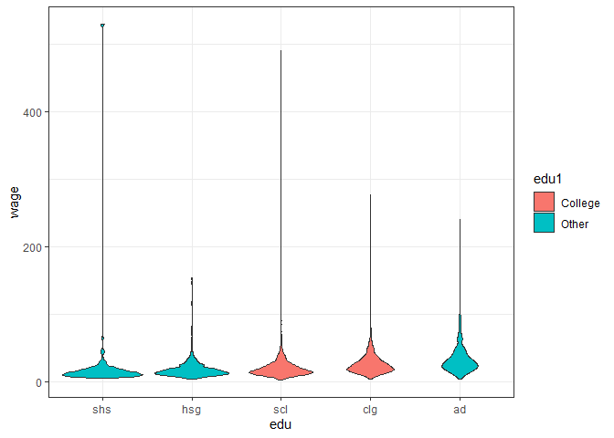
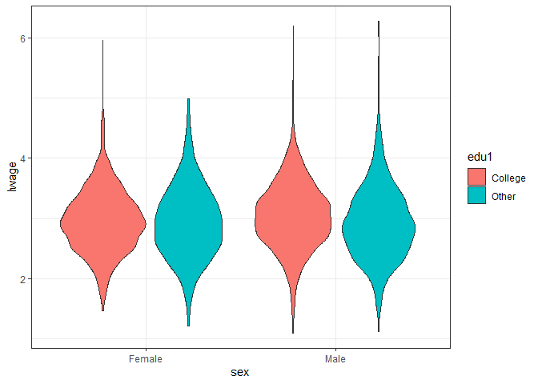
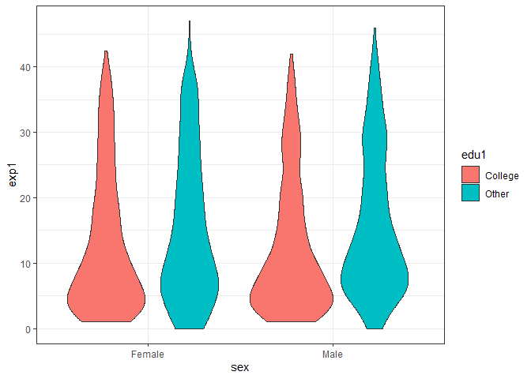
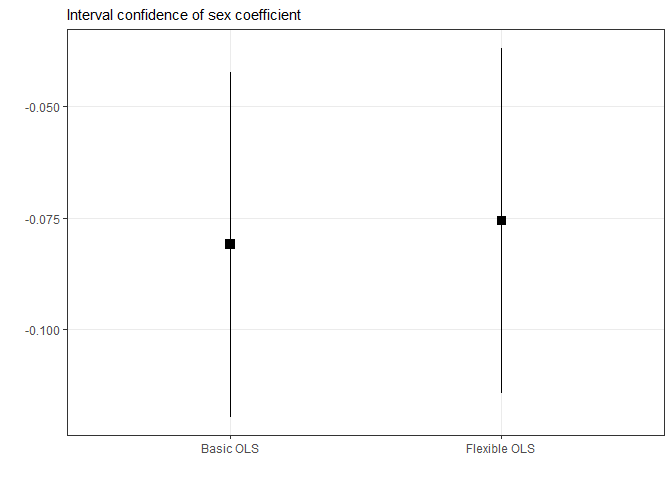

``` r
# 
# install.packages("librarian")
knitr::opts_chunk$set(
  message = F
  , warning = F
)
options(scipen = 999)
librarian::shelf(
  tidyverse
  , here
  , tidymodels
  , gghighlight
  , forcats
  , broom
  , rsample
  , yardstick
  , coefplot
  , patchwork
)
theme_set(theme_bw())
```

``` r
wage <- read_csv(dir(here(), pattern = ".csv$", full.names = T, recursive = T))
wage_lng <- wage |> 
  pivot_longer(shs:ad, names_to = "edu") |> 
  filter(value > 0) |> 
  select(!value) |> 
  mutate(
    edu = factor(edu, c("shs", "hsg", "scl", "clg", "ad"))
    , edu1 = ifelse(edu %in% c("scl", "clg"), "College", "Other")
    , sex = ifelse(sex == 1, "Female", "Male")
         )

head(wage, 5)
```

    ## # A tibble: 5 x 21
    ##   rownames  wage lwage   sex   shs   hsg   scl   clg    ad    mw    so    we
    ##      <dbl> <dbl> <dbl> <dbl> <dbl> <dbl> <dbl> <dbl> <dbl> <dbl> <dbl> <dbl>
    ## 1       10  9.62  2.26     1     0     0     0     1     0     0     0     0
    ## 2       12 48.1   3.87     0     0     0     0     1     0     0     0     0
    ## 3       15 11.1   2.40     0     0     1     0     0     0     0     0     0
    ## 4       18 13.9   2.63     1     0     0     0     0     1     0     0     0
    ## 5       19 28.8   3.36     1     0     0     0     1     0     0     0     0
    ## # ... with 9 more variables: ne <dbl>, exp1 <dbl>, exp2 <dbl>, exp3 <dbl>,
    ## #   exp4 <dbl>, occ <dbl>, occ2 <dbl>, ind <dbl>, ind2 <dbl>

### Plots

``` r
w_edu <- 
  wage_lng |> 
  ggplot() +
  aes(y = wage, edu, fill = edu1) +
  geom_violin() 
  
lw_edu <- 
  w_edu +
  aes(y = lwage)

edu_per <- 
  wage_lng |> 
  count(edu) |> 
  mutate(per = n / sum(n)) |> 
  ggplot() +
  geom_col() +
  aes(x = fct_reorder(edu, n), per, fill = edu) +
  scale_y_continuous(label = scales::percent)
w_edu 
```

<!-- -->

``` r
lw_edu 
```

<!-- -->

``` r
edu_per
```

<!-- -->

``` r
sx_ed_w <- 
  wage_lng |> 
  ggplot() +
  aes(y = wage, sex, fill = edu1) +
  geom_violin() 
sx_ed_lw <- 
  sx_ed_w +
  aes(y = lwage)
sx_ed_w
```

<!-- -->

``` r
sx_ed_lw
```

<!-- -->

``` r
sx_ed_w <- 
  wage_lng |> 
  ggplot() +
  aes(y = exp1, sex, fill = edu1) +
  geom_violin() 
sx_ed_w
```

<!-- -->

``` r
sx_ed_w +
  aes(fill = edu, x = edu) +
  facet_wrap(~sex, ncol = 1)
```

<!-- -->

## Models

``` r
split <- rsample::initial_split(wage, prop = .6, strata = lwage)
tr_wg <- training(split)
ts_wg <- testing(split)
```

``` r
wg_ols <- 
  lm(lwage ~ sex + exp1 + shs + hsg + mw + so + we + occ2 + ind2, data = tr_wg)
wg_flex <- 
  lm(
    lwage ~ sex+(exp1 + exp2 + exp3 + exp4 + shs + hsg + occ2 + ind2 + mw + so + we)^2
    , data = tr_wg
    )
```

``` r
tbl <- function(md, name_md = "ols"){
  train <- 
    broom::augment(md) |> 
    mutate(r = (lwage - .fitted)^2) 
  
  test <- ts_wg |> 
    add_column(.fitted = predict(md, newdata = ts_wg)) |> 
    mutate(r = (lwage - .fitted)^2) 
  
  mse <- c(pull(train, r) |> mean(), pull(test, r) |> mean())
  r2_tr <- yardstick::rsq(broom::augment(md), lwage, .fitted) |> pull(3)
  r2_ts <- yardstick::rsq(add_column(ts_wg, .fitted = predict(md, newdata = ts_wg)), lwage, .fitted) |> pull(3)
  r2 <- c(r2_tr, r2_ts)
  # r2
  tibble(model = name_md, type = c("train", "test"), mse, r2) 
}

map2_df(.x = list(wg_flex, wg_ols), .y = c("Basic OLS", "Flexible OLS"), tbl) |> 
  knitr::kable()
```

| model        | type  |       mse |        r2 |
|:-------------|:------|----------:|----------:|
| Basic OLS    | train | 0.2546812 | 0.2075742 |
| Basic OLS    | test  | 0.2805165 | 0.1583504 |
| Flexible OLS | train | 0.2639484 | 0.1787401 |
| Flexible OLS | test  | 0.2731944 | 0.1752445 |

## CoefPlot

``` r
coef_tbl <- function(md, name){
  md |> 
  confint(level = .95) |> 
  as_tibble(rownames = "is") |> 
  rename(min = 2, max = 3) |> 
  add_column(tidy(md)) |> 
  filter(is == "sex") |> 
  mutate(model = name) |> 
  select(model, estimate, min, max)
}


map2_df(list(wg_ols, wg_flex), c("Basic OLS", "Flexible OLS"), coef_tbl) |> 
  ggplot() +
  aes(model, estimate, ymin = min, ymax = max) +
  geom_point(shape = 15, size = 3) +
  geom_linerange() +
  labs(subtitle = "Interval confidence of sex coefficient", x= "", y = "") +
  
  theme(
    panel.grid.minor = element_blank()
  )
```

<!-- -->

## Wage - Experience

``` r
wage |> 
  select(lwage, clg, hsg, exp1) |> 
  rename("College" = 2 ,"High School" = 3) |> 
  pivot_longer(!c(lwage, exp1)) |> 
  filter(value > 0) |> 
  ggplot() +
  aes(exp1, lwage, group = name, color = name) +
  geom_smooth(formula = y ~ poly(x, 2), se = F) +
  labs(x = "Year of Potential Experience", y = "Log Wage", color = "") +
  theme(legend.position = "top")
```

<!-- -->
