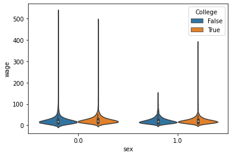
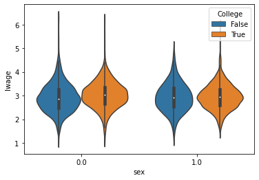
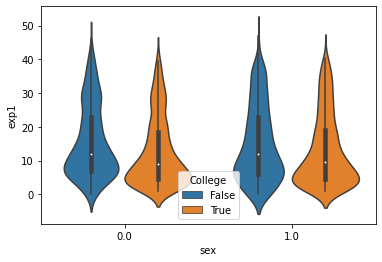
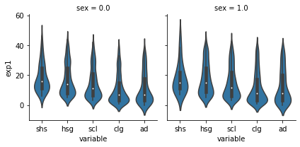
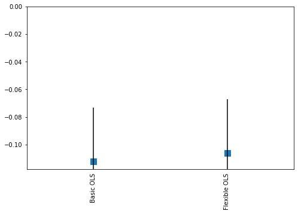
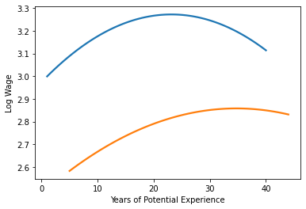

```python
import pandas as pd
import numpy as np
import seaborn as sns
from matplotlib import pyplot as plt
import statsmodels.formula.api as smf
from sklearn.model_selection import train_test_split
from sklearn.metrics import mean_squared_error as msqe
from sklearn.metrics import r2_score as r2

```


```python
features = ['sex', 'exp1', 'exp2', 'exp3', 'exp4', 'shs', 'hsg', 'occ2', 'ind2', 'mw', 'so', 'we']
target = ['lwage']
```


```python
wage = pd.read_csv("./data/wage2015_subsample_inference.csv")
wage_long = wage.melt(id_vars = ['rownames', 'wage', 'lwage', 'sex', 'mw', 'so', 'we', 'ne', 'exp1', 'exp2', 'exp3', 'exp4', 'occ', 'occ2', 'ind', 'ind2'])
wage_long = wage_long[wage_long.value>0]
```


```python
wage_long['College'] = wage_long["variable"].isin(["scl", "clg"])
```

### Plots


```python
sns.violinplot(x = "variable", y = "wage", hue = 'College', data = wage_long)
```


    <AxesSubplot:xlabel='variable', ylabel='wage'>


    

    


```python
sns.violinplot(x = "variable", y = "lwage", data = wage_long, hue = "College")
```


    <AxesSubplot:xlabel='variable', ylabel='lwage'>


    

    


```python
sns.violinplot(x = "sex", y = "wage", hue = "College", data = wage_long)
```


    <AxesSubplot:xlabel='sex', ylabel='wage'>


    

    


```python
sns.violinplot(x = "sex", y = "lwage", hue = "College", data = wage_long)
```


    <AxesSubplot:xlabel='sex', ylabel='lwage'>


    

    


```python
sns.violinplot(x = "sex", y = "exp1", hue = "College", data = wage_long)
```


    <AxesSubplot:xlabel='sex', ylabel='exp1'>


    

    


```python
g = sns.FacetGrid(wage_long, col = "sex")
g.map(sns.violinplot, "variable", "exp1")
```

    c:\users\jhon\appdata\local\programs\python\python37\lib\site-packages\seaborn\axisgrid.py:670: UserWarning: Using the violinplot function without specifying `order` is likely to produce an incorrect plot.
      warnings.warn(warning)
    


    <seaborn.axisgrid.FacetGrid at 0x22d46720940>


    

    


### Models


```python
wage_y = wage[target]
wage_x = wage[features]

x_tr_wg, x_ts_wg, y_tr_wg, y_ts_wg = train_test_split(
  wage_x, wage_y, test_size = .4, random_state = 12
)

x_tr_wg["lwage"] = y_tr_wg
x_ts_wg['lwage'] = y_ts_wg

tr_wg =  pd.DataFrame(x_tr_wg) 
ts_wg = pd.DataFrame(x_ts_wg)


### 

ols = ' lwage ~ sex + exp1 + shs + hsg + mw + so + we + occ2 + ind2'
flex = ' lwage ~ sex+(exp1+exp2+exp3+exp4+shs+hsg +occ2+ind2 + mw + so + we)**2'

ols_reg = smf.ols(ols, data = tr_wg).fit()
flx_reg = smf.ols(flex, data = tr_wg).fit()

mse =  [
    msqe(y_tr_wg, ols_reg.predict(x_tr_wg)),
    msqe(y_ts_wg, ols_reg.predict(x_ts_wg)),
    msqe(y_tr_wg, flx_reg.predict(x_tr_wg)),
    msqe(y_ts_wg, flx_reg.predict(x_ts_wg))
  ]

r_2 =  [
    r2(y_tr_wg, ols_reg.predict(x_tr_wg)),
    r2(y_ts_wg, ols_reg.predict(x_ts_wg)),
    r2(y_tr_wg, flx_reg.predict(x_tr_wg)),
    r2(y_ts_wg, flx_reg.predict(x_ts_wg))
  ]
  

ref = {
  'Models' : ["Basic OLS", "Basic OLS", "Flexible OLS", "Flexible OLS"],
  'Type' : ["train", "test", "train", "test"]
  , "mse" : mse
  , "r2" : r_2
}
pd.DataFrame(ref)
```


<div>
<style scoped>
    .dataframe tbody tr th:only-of-type {
        vertical-align: middle;
    }

    .dataframe tbody tr th {
        vertical-align: top;
    }

    .dataframe thead th {
        text-align: right;
    }
</style>
<table border="1" class="dataframe">
  <thead>
    <tr style="text-align: right;">
      <th></th>
      <th>Models</th>
      <th>Type</th>
      <th>mse</th>
      <th>r2</th>
    </tr>
  </thead>
  <tbody>
    <tr>
      <th>0</th>
      <td>Basic OLS</td>
      <td>train</td>
      <td>0.275718</td>
      <td>0.179506</td>
    </tr>
    <tr>
      <th>1</th>
      <td>Basic OLS</td>
      <td>test</td>
      <td>0.256585</td>
      <td>0.169958</td>
    </tr>
    <tr>
      <th>2</th>
      <td>Flexible OLS</td>
      <td>train</td>
      <td>0.266181</td>
      <td>0.207887</td>
    </tr>
    <tr>
      <th>3</th>
      <td>Flexible OLS</td>
      <td>test</td>
      <td>0.254452</td>
      <td>0.176859</td>
    </tr>
  </tbody>
</table>
</div>


### Coefplots


```python
coef_ref = {
    "Model": ["Basic OLS", "Flexible OLS"],
    "coef": [ols_reg.params.values[1], flx_reg.params.values[1]],
    "err": [(ols_reg.params - ols_reg.conf_int()[0])[1], (flx_reg.params - flx_reg.conf_int()[0])[1]]
}
coef_ref = pd.DataFrame(coef_ref)
coef_ref

```


<div>
<style scoped>
    .dataframe tbody tr th:only-of-type {
        vertical-align: middle;
    }

    .dataframe tbody tr th {
        vertical-align: top;
    }

    .dataframe thead th {
        text-align: right;
    }
</style>
<table border="1" class="dataframe">
  <thead>
    <tr style="text-align: right;">
      <th></th>
      <th>Model</th>
      <th>coef</th>
      <th>err</th>
    </tr>
  </thead>
  <tbody>
    <tr>
      <th>0</th>
      <td>Basic OLS</td>
      <td>-0.112061</td>
      <td>0.038963</td>
    </tr>
    <tr>
      <th>1</th>
      <td>Flexible OLS</td>
      <td>-0.106377</td>
      <td>0.038958</td>
    </tr>
  </tbody>
</table>
</div>


```python
fig, ax = plt.subplots(figsize=(8, 5))
coef_ref.plot(x = "Model", y = "coef", kind = "bar", ax = ax, color = "none",yerr = "err", legend = False)
ax.set_ylabel('')
ax.set_xlabel('')
ax.xaxis.set_ticks_position('none')
ax.scatter(x = coef_ref["Model"], y = coef_ref["coef"], marker = 's', s = 120)
```


    <matplotlib.collections.PathCollection at 0x22d46739a90>


    

    


```python

```

### Wage - Experience


```python
wage_exp = wage[['lwage', 'clg', 'hsg', 'exp1']]
wage_exp1 = wage_exp.melt(id_vars = ['lwage', 'exp1'])
wage_exp1 = wage_exp1[wage_exp1.value>0]
wage_exp1
```


<div>
<style scoped>
    .dataframe tbody tr th:only-of-type {
        vertical-align: middle;
    }

    .dataframe tbody tr th {
        vertical-align: top;
    }

    .dataframe thead th {
        text-align: right;
    }
</style>
<table border="1" class="dataframe">
  <thead>
    <tr style="text-align: right;">
      <th></th>
      <th>lwage</th>
      <th>exp1</th>
      <th>variable</th>
      <th>value</th>
    </tr>
  </thead>
  <tbody>
    <tr>
      <th>0</th>
      <td>2.263364</td>
      <td>7.0</td>
      <td>clg</td>
      <td>1.0</td>
    </tr>
    <tr>
      <th>1</th>
      <td>3.872802</td>
      <td>31.0</td>
      <td>clg</td>
      <td>1.0</td>
    </tr>
    <tr>
      <th>4</th>
      <td>3.361977</td>
      <td>22.0</td>
      <td>clg</td>
      <td>1.0</td>
    </tr>
    <tr>
      <th>5</th>
      <td>2.462215</td>
      <td>1.0</td>
      <td>clg</td>
      <td>1.0</td>
    </tr>
    <tr>
      <th>9</th>
      <td>2.956512</td>
      <td>4.0</td>
      <td>clg</td>
      <td>1.0</td>
    </tr>
    <tr>
      <th>...</th>
      <td>...</td>
      <td>...</td>
      <td>...</td>
      <td>...</td>
    </tr>
    <tr>
      <th>10285</th>
      <td>2.563469</td>
      <td>15.0</td>
      <td>hsg</td>
      <td>1.0</td>
    </tr>
    <tr>
      <th>10287</th>
      <td>2.599837</td>
      <td>8.0</td>
      <td>hsg</td>
      <td>1.0</td>
    </tr>
    <tr>
      <th>10291</th>
      <td>3.117780</td>
      <td>15.0</td>
      <td>hsg</td>
      <td>1.0</td>
    </tr>
    <tr>
      <th>10292</th>
      <td>2.822980</td>
      <td>11.0</td>
      <td>hsg</td>
      <td>1.0</td>
    </tr>
    <tr>
      <th>10298</th>
      <td>3.495508</td>
      <td>10.0</td>
      <td>hsg</td>
      <td>1.0</td>
    </tr>
  </tbody>
</table>
<p>2892 rows × 4 columns</p>
</div>


```python
sns.regplot(x = "exp1", y = "lwage", data = wage_exp1[wage_exp1.variable == "clg"], scatter = False, ci = None, order = 2)
sns.regplot(x = "exp1", y = "lwage", data = wage_exp1[wage_exp1.variable == "hsg"], scatter = False, ci = None, order = 2)
plt.xlabel("Years of Potential Experience")
plt.ylabel("Log Wage")
```


    Text(0, 0.5, 'Log Wage')


    

    


```python

```


```python

```
